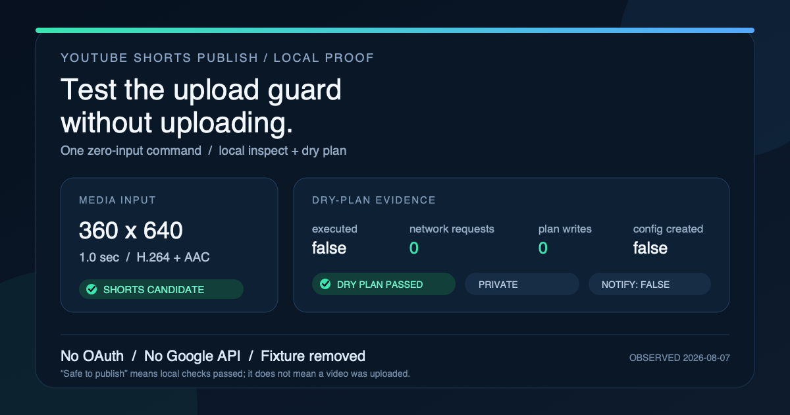

# YouTube Skills

[](https://skills.sh/L4A-ai/youtube-skills)

Agent skills for working with YouTube through the user's own channel. The first skill publishes an
already-created YouTube Short through the official API with unusually careful safety boundaries:
local media inspection, a truly side-effect-free plan, explicit per-upload confirmation,
private-by-default resumable transfer, and processing-state read-back.

## `youtube-shorts-publish`

Install the skill with:

```bash
npx skills add L4A-ai/youtube-skills --skill youtube-shorts-publish
```

## Try it safely in 5 minutes

No Google account, OAuth client, channel access, or real video is required. The packaged verifier
creates a one-second portrait fixture in a temporary directory, runs only local inspection and
planning, and removes the fixture before it returns. It cannot upload or change a YouTube channel.
Its output distinguishes the expected temporary fixture write from the dry plan's zero local writes.

Requirements: Node.js 20+ and FFmpeg.

After installing the skill, paste this into your agent:

> Use `$youtube-shorts-publish` to run the documented zero-input, zero-publish installation check.
> Locate the installed skill directory and, from that directory, run exactly
> `node examples/verify-zero-publish.mjs` with no arguments. Do not access Google, YouTube, OAuth
> credentials, or the network. Return the verifier stdout unchanged.

[](media/youtube-zero-publish-proof.svg)

This dated card is local capability and safety-contract evidence, not install, adoption,
live-upload, or user-attribution evidence.

Exact command from the installed skill directory:

```bash
node examples/verify-zero-publish.mjs
```

Expected stdout (one line):

```json
{"schema_version":"1.0","skill_version":"0.1.0","fixture":"generated-360x640-h264-aac","status":"ok","inspection":{"displayed_dimensions":{"width":360,"height":640},"duration_seconds":1,"video_codec":"h264","audio_codec":"aac","shorts_candidate":true},"plan":{"safe_to_publish":true,"privacy":"private","notify_subscribers":false,"executed":false},"safety":{"oauth_used":false,"network_guard_armed":true,"network_requests":0,"youtube_writes":0,"plan_local_writes":0,"config_dir_created":false,"credential_files_created":false,"temporary_fixture_written":true,"temporary_artifacts_removed":true},"passed":true}
```

`safe_to_publish` means the local plan passed its checks. It does not mean anything was uploaded.
`plan_local_writes: 0` applies to the dry plan; the verifier writes and then removes its generated
fixture under the operating system's temporary directory. Before running the CLI, the verifier
proves its bundled network guard with a deliberately blocked canary; both CLI commands run under
that same guard.
Configure OAuth only when you decide to test a real, explicitly confirmed upload.

[Send a structured zero-publish evaluation report](https://github.com/L4A-ai/youtube-skills/issues/new?template=zero-publish-evaluation.yml)
after your run. Only a reporter who independently installed and actually ran
`youtube-shorts-publish` for their own non-internal purpose, and attests that they are not a
maintainer, a maintainer's teammate, or an internal tester, may select the completed count-eligible
outcome. Install-only and failed attempts are still useful for improving onboarding, but they do
not count as completed runs. Never include OAuth credentials, tokens, client secrets,
authorization codes, or a real channel ID in a report.

It supports:

- `inspect` — ffprobe duration, displayed dimensions, rotation, SAR, codecs, audio, and local
  Shorts eligibility.
- `plan` — source SHA-256, stable plan ID, and exact API payload with zero network requests, OAuth
  reads, token refreshes, or local writes.
- `auth` — bring-your-own Google Cloud Desktop OAuth client, loopback callback, PKCE, and the least
  combined scopes for this workflow: `youtube.upload` plus `youtube.readonly`.
- `publish` — dry-run by default; `--yes` is the only real write path; private and subscriber-silent
  by default; resumable 8 MiB chunks with proactive OAuth renewal.
- `status` — semantic processing/visibility read-back by the returned video ID.

The CLI never treats `#Shorts` as a classification switch. YouTube classifies eligible square or
vertical videos up to three minutes on the service side, and the Data API exposes no reliable Shorts
flag. Results therefore say `shorts_candidate`, not “confirmed in the Shorts Feed.”

## Quick start from a checkout

Requirements: Node.js 20+ and FFmpeg's `ffprobe`. There are no npm runtime dependencies.

```bash
cd skills/youtube-shorts-publish
node scripts/ytshorts.mjs doctor
node scripts/ytshorts.mjs inspect /absolute/path/short.mp4
```

Follow [the OAuth setup](skills/youtube-shorts-publish/references/oauth-setup.md), then authorize:

```bash
node scripts/ytshorts.mjs auth
```

Build a local-only plan using the returned channel ID:

```bash
node scripts/ytshorts.mjs plan /absolute/path/short.mp4 \
  --title "Launch day in 30 seconds" \
  --channel-id UCxxxxxxxxxxxxxxxxxxxxxx \
  --privacy private \
  --made-for-kids no \
  --contains-synthetic-media no
```

`publish` without `--yes` is also a dry run. A real upload requires both `--yes` and that dry run's
`--expected-plan-id`; the CLI re-hashes the media and request before loading OAuth. Only continue
when the user has authorized that exact upload.

For the write itself, the CLI snapshots the confirmed bytes, creates a durable one-shot attempt
receipt, and uploads that snapshot. The same plan ID is refused on repeat so a crash or lost response
does not silently create duplicates. `--new-attempt` is an exceptional override used only after the
operator checks YouTube Studio and explicitly confirms that no prior video exists. A deterministic
retry receipt makes that override single-use, a known prior video ID cannot be overridden, and only
a primary receipt already recorded as `ambiguous` is eligible—active-looking attempts fail closed.

## Why this differs from existing upload skills

Most YouTube Shorts skills generate or optimize content but do not publish it. Existing uploaders
often authenticate before their dry-run, default to unlisted/public, use `#Shorts` as a proxy for
classification, or trust the initial API response. This implementation instead:

- keeps planning structurally separate from OAuth and network code;
- binds confirmation to the source bytes and normalized request with a stable plan ID;
- persists a one-shot receipt before mutation and separates `upload_accepted` from verified success;
- requires the exact authorized channel ID and explicit compliance declarations;
- resumes from YouTube's acknowledged byte offset rather than restarting an insert;
- verifies processing and actual privacy by video ID;
- never searches or deletes by title and never retries an ambiguous upload blindly.

## Scope

One account, one user-owned channel. No bulk multi-account posting, proxy rotation, quota evasion,
or platform-integrity bypasses. Video generation/editing is intentionally outside this skill; it
offers explicit FFmpeg preparation recipes when local preflight finds a blocker.

## Development

From the repository root, validate the source-only report and proof contracts:

```bash
ruby .github/scripts/check-zero-publish-report.rb
ruby .github/scripts/check-zero-publish-proof.rb
```

Then run the self-contained skill checks:

```bash
cd skills/youtube-shorts-publish
npm run check
npm test
```

Tests are offline and use a local fake resumable server; they never contact Google or upload a real
video. The skill is self-contained because installers copy only `skills/youtube-shorts-publish/`.

## License

MIT — see [LICENSE](LICENSE).
