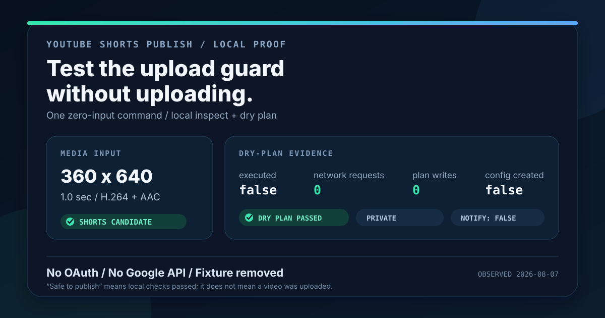

# YouTube Skills

[](https://skills.sh/L4A-ai/youtube-skills)

Agent skills for working with YouTube through the user's own channel. The first skill publishes an
already-created YouTube Short through the official API with unusually careful safety boundaries:
local media inspection, a truly side-effect-free plan, explicit per-upload confirmation,
private-by-default resumable transfer, and processing-state read-back.

## `youtube-shorts-publish`

Install the skill with:

```bash
npx skills add L4A-ai/youtube-skills --skill youtube-shorts-publish
```

## Try it safely in 5 minutes

No Google account, OAuth client, channel access, or real video is required. This evaluation creates
a one-second portrait fixture in a temporary directory and runs only local inspection and planning.
It cannot upload or change a YouTube channel. FFmpeg writes only the temporary fixture; the
`plan` command must report zero network requests and zero local writes.

Requirements: Node.js 20+ and FFmpeg.

After installing the skill, paste this into your agent:

> Use `$youtube-shorts-publish` to run a zero-publish safety evaluation. Locate the installed skill
> directory. Do not run `auth`, `status`, `publish`, or any command with `--yes`. Create a fresh
> temporary directory and use FFmpeg to generate a one-second 360x640 black H.264 video with silent
> AAC audio. Run `inspect` on it. Then set `YTSHORTS_CONFIG_DIR` to a nonexistent `no-state` path
> inside that temporary directory and run `plan` with title `5-minute safety check`, channel ID
> `UCaaaaaaaaaaaaaaaaaaaaaa`, `--privacy private`, `--notify-subscribers no`,
> `--made-for-kids no`, and `--contains-synthetic-media no`. Return only the displayed dimensions,
> duration, codecs, `shorts_candidate`, `safe_to_publish`, privacy, subscriber notification setting,
> `executed`, `network_requests`, `local_writes`, and whether the `no-state` path was created.



Expected proof:

```json
{
  "displayed_dimensions": {"width": 360, "height": 640},
  "duration_seconds": 1,
  "video_codec": "h264",
  "audio_codec": "aac",
  "shorts_candidate": true,
  "safe_to_publish": true,
  "privacy": "private",
  "notify_subscribers": false,
  "executed": false,
  "network_requests": 0,
  "local_writes": 0,
  "config_dir_created": false
}
```

`safe_to_publish` means the local plan passed its checks. It does not mean anything was uploaded.
Configure OAuth only when you decide to test a real, explicitly confirmed upload.

It supports:

- `inspect` — ffprobe duration, displayed dimensions, rotation, SAR, codecs, audio, and local
  Shorts eligibility.
- `plan` — source SHA-256, stable plan ID, and exact API payload with zero network requests, OAuth
  reads, token refreshes, or local writes.
- `auth` — bring-your-own Google Cloud Desktop OAuth client, loopback callback, PKCE, and the least
  combined scopes for this workflow: `youtube.upload` plus `youtube.readonly`.
- `publish` — dry-run by default; `--yes` is the only real write path; private and subscriber-silent
  by default; resumable 8 MiB chunks with proactive OAuth renewal.
- `status` — semantic processing/visibility read-back by the returned video ID.

The CLI never treats `#Shorts` as a classification switch. YouTube classifies eligible square or
vertical videos up to three minutes on the service side, and the Data API exposes no reliable Shorts
flag. Results therefore say `shorts_candidate`, not “confirmed in the Shorts Feed.”

## Quick start from a checkout

Requirements: Node.js 20+ and FFmpeg's `ffprobe`. There are no npm runtime dependencies.

```bash
cd skills/youtube-shorts-publish
node scripts/ytshorts.mjs doctor
node scripts/ytshorts.mjs inspect /absolute/path/short.mp4
```

Follow [the OAuth setup](skills/youtube-shorts-publish/references/oauth-setup.md), then authorize:

```bash
node scripts/ytshorts.mjs auth
```

Build a local-only plan using the returned channel ID:

```bash
node scripts/ytshorts.mjs plan /absolute/path/short.mp4 \
  --title "Launch day in 30 seconds" \
  --channel-id UCxxxxxxxxxxxxxxxxxxxxxx \
  --privacy private \
  --made-for-kids no \
  --contains-synthetic-media no
```

`publish` without `--yes` is also a dry run. A real upload requires both `--yes` and that dry run's
`--expected-plan-id`; the CLI re-hashes the media and request before loading OAuth. Only continue
when the user has authorized that exact upload.

For the write itself, the CLI snapshots the confirmed bytes, creates a durable one-shot attempt
receipt, and uploads that snapshot. The same plan ID is refused on repeat so a crash or lost response
does not silently create duplicates. `--new-attempt` is an exceptional override used only after the
operator checks YouTube Studio and explicitly confirms that no prior video exists. A deterministic
retry receipt makes that override single-use, a known prior video ID cannot be overridden, and only
a primary receipt already recorded as `ambiguous` is eligible—active-looking attempts fail closed.

## Why this differs from existing upload skills

Most YouTube Shorts skills generate or optimize content but do not publish it. Existing uploaders
often authenticate before their dry-run, default to unlisted/public, use `#Shorts` as a proxy for
classification, or trust the initial API response. This implementation instead:

- keeps planning structurally separate from OAuth and network code;
- binds confirmation to the source bytes and normalized request with a stable plan ID;
- persists a one-shot receipt before mutation and separates `upload_accepted` from verified success;
- requires the exact authorized channel ID and explicit compliance declarations;
- resumes from YouTube's acknowledged byte offset rather than restarting an insert;
- verifies processing and actual privacy by video ID;
- never searches or deletes by title and never retries an ambiguous upload blindly.

## Scope

One account, one user-owned channel. No bulk multi-account posting, proxy rotation, quota evasion,
or platform-integrity bypasses. Video generation/editing is intentionally outside this skill; it
offers explicit FFmpeg preparation recipes when local preflight finds a blocker.

## Development

```bash
cd skills/youtube-shorts-publish
npm run check
npm test
```

Tests are offline and use a local fake resumable server; they never contact Google or upload a real
video. The skill is self-contained because installers copy only `skills/youtube-shorts-publish/`.

## License

MIT — see [LICENSE](LICENSE).
